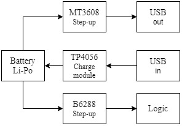

# Power-bank
## Description

**Telling you right away - this is an educational project. My goal was to build a needlessly complex system to try a new ICs, sensors, etc.**
Power bank is a portable charger device. It designed to recharge electronic gadgets when you don't have access to a regular wall charger. As I don't dont have one I decide to build my own power bank. 

### Features 
* 3 parallel 18650 Li-Po batteries with total capacity up to 10000mAh(at 3.7V);
* One output USB connector. USB type-c input connector;
* Output parameters: 5V 2A;
* OLED display. Real-time indication of charging statuses;
* 4 level LED battery capacity indication;
* Beautiful LED glowing :)

### Power

Step-up MT3608 based module is responsible for power bank output characteristics MT3608 is generating 5V output. 18650 minimal allowed voltage is 2.5V. MT3608 minimum input voltage is 2V. So requared 5V would be during full battery lifespan. TP4056 is an linear charger IC. It work is to control charge cycle, to charge to fix 4.2V with constant current which can be programmed externally with a single resistor. To power up a device logic part a step-up B6288 based module was used. It is 5V 0.4W module(max current was determinated experimentally).

### Logic

